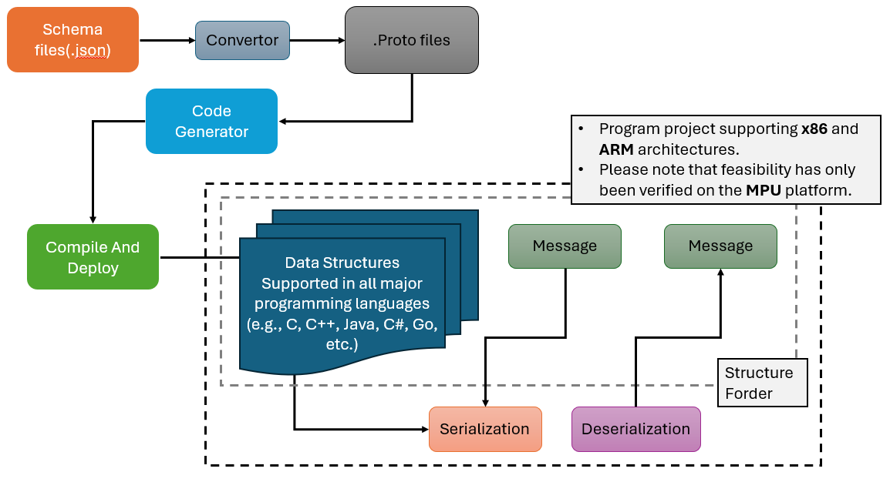

# Table of Contents

<!-- vscode-markdown-toc -->
* 1. [Workflow Overview](#WorkflowOverview)
* 2. [Project Structure](#ProjectStructure)
* 3. [Recommended Usage (One-Command Flow)](#RecommendedUsageOne-CommandFlow)
	* 3.0. [Environment Requirements](#EnvironmentRequirements)
	* 3.1. [Install Dependencies](#InstallDependencies)
	* 3.2. [Use schema_generator.py to do everything end-to-end](#Useschema_generator.pytodoeverythingend-to-end)
	* 3.3. [Run the sample code using C or C++ language for the example](#RunthesamplecodeusingCorClanguagefortheexample)
* 4. [Appendix A — Manual Two-Step Flow (Optional)](#AppendixAManualTwo-StepFlowOptional)
	* 4.1. [Generate .proto from JSON Schemas](#A.1Generate.protofromJSONSchemas)
	* 4.2. [Generate Source Code from .proto](#A.2.GenerateSourceCodefrom.proto)
* 5. [Appendix B — References & Verified Specifications](#AppendixBReferencesVerifiedSpecifications)
	* 5.1. [JSON Schema Sources](#B.1JSONSchemaSources)
* 6. [Future Work](#FutureWork)
* 7. [Disclaimer](#Disclaimer)

<!-- vscode-markdown-toc-config
	numbering=true
	autoSave=true
	/vscode-markdown-toc-config -->
<!-- /vscode-markdown-toc -->
# Machnata — Universal JSON Schema → Protobuf Generator → Portable Data Structures for All Major Languages

This project converts **any JSON Schema** into `.proto` files, which can then be compiled with `protoc` to generate source code in any language supported by Protocol Buffers.

It serves as a **universal schema-to-code generation framework**, successfully validated through real-world specifications such as **OCPP**, **OCPI**, and **HL7**.

By leveraging this tool, developers can:

- **Accelerate development across domains** — Automatically generate strongly-typed data structures for any schema-defined model, drastically reducing manual coding time.  
- **Ensure cross-platform consistency** — Shared types and enums are generated once and reused across languages, minimizing human error and improving maintainability.  
- **Support embedded environments** — Generated `.proto` files can be compiled into C/C++ for firmware or into higher-level languages like Python, Java, and Go for software systems.  
- **Multi-language ready** — Generate portable data and communication structures for every platform supported by Protocol Buffers.  

In short, this generator helps teams **transform standard JSON Schemas into maintainable, language-agnostic data models**, enabling consistent integration from embedded devices to cloud systems.

##  1. <a name='WorkflowOverview'></a>Workflow Overview



The workflow illustrated in the diagram can be summarized as follows:

1. **Schema (.json) files** — Serve as the original source definitions that describe message structures and data types.  
2. **Converter** — Translates JSON Schemas into `.proto` definitions, ensuring type fidelity and structural consistency.  
3. **Code Generator** — Compiles `.proto` files into source code for multiple programming languages supported by Protocol Buffers.  
4. **Portable Data Structures** — Produces fully interoperable and language-agnostic data models (C, C++, Java, C#, Go, Python, and more).  
5. **Serialization & Deserialization** — Enables efficient binary communication through serialization for transmission and deserialization for message reconstruction.  

This end-to-end process ensures **consistent, cross-platform, and maintainable communication stacks**, minimizing manual effort and eliminating discrepancies between implementations.

> **Note:** The generated code can be built and integrated into applications across different system architectures (x86, ARM, etc.), with practical verification on MPU-based environments.  

> **Tip:** When cross-compiling with the Yocto Project, it is recommended to generate all Protobuf schema sources (`.pb.cc` and `.pb.h`) using the `protoc-native` tool provided by your Yocto build environment, as defined in your `.bb` recipe.

##  2. <a name='ProjectStructure'></a> Project Structure
```
.
├── doc/                                # Diagrams, flowcharts, additional docs (e.g., docs-generator-flowchart.png)
├── output/
│   ├── gen/                            # Language-specific code generated by protoc (c_out, cpp_out, java_out, python_out, csharp_out, go_out, etc.)
│   └── proto/                          # .proto files generated from JSON Schemas
│       ├── HL7/                        # HL7 proto package
│       │   └── types/                  # Aggregated HL7 shared types
│       │       └── enums/              # HL7 enums (one file per enum)
│       ├── OCPI/                       # OCPI proto packages (multiple versions)
│       │   ├── v211/
│       │   │   └── types/
│       │   │       └── enums/
│       │   ├── v22/
│       │   │   └── types/
│       │   │       └── enums/
│       │   └── v221/
│       │       └── types/
│       │           └── enums/
│       └── OCPP/                       # OCPP proto packages (v16 / v201 / v21)
│           ├── v16/                    # OCPP 1.6 .proto (top-level messages + types/)
│           │   └── types/              # Shared types for v16
│           │       └── enums/          # Enums for v16
│           ├── v201/                   # OCPP 2.0.1 .proto
│           │   └── types/
│           │       └── enums/
│           └── v21/                    # OCPP 2.1 .proto
│               └── types/
│                   └── enums/
├── resources/
│   ├── schemas/                        # Source JSON Schemas (input to json_to_proto.py)
│   │   ├── HL7/                        # HL7 JSON schemas
│   │   ├── OCPI/                       # OCPI JSON schemas (v211 / v22 / v221)
│   │   │   ├── v211/
│   │   │   ├── v22/
│   │   │   └── v221/
│   │   └── OCPP/                       # OCPP JSON schemas (v16 / v201 / v21)
│   │       ├── v16/
│   │       ├── v201/
│   │       └── v21/
│   └── yocto/                          # Yocto-related notes/snippets (e.g., protoc-native usage in recipes)
├── src/                                # Generators and orchestration scripts
│   ├── json_to_proto.py                # JSON Schema → .proto converter
│   └── schema_generator.py             # End-to-end orchestrator (.json → .proto → code for selected langs)
└── test/
    ├── c/                              # C (protobuf-c/nanopb) example & build files
    └── cpp/                            # C++ example (CMake) for quick validation
```

##  3. <a name='RecommendedUsageOne-CommandFlow'></a> Recommended Usage (One-Command Flow)

### 3.0.<a name='EnvironmentRequirements'></a> Environment Requirements
This project is developed and tested primarily on **Linux-based environments** (Ubuntu recommended).  
Other operating systems are not officially supported at this time.

| Component | Recommended Version | Notes |
|------------|--------------------|-------|
| **Operating System** | Linux (Ubuntu 22.04+ preferred) | macOS may work with manual dependency installation; Windows is **not officially supported** |
| **Python** | ≥ 3.9 | Verified on **Python 3.10.12** |
| **Protobuf Compiler (`protoc`)** | ≥ 3.12 | Verified on **libprotoc 3.12.4** |

> 💡 **Tip:**  
> The project has been verified on **Ubuntu 22.04.5 LTS (Jammy Jellyfish)** with  
> **Python 3.10.12** and **libprotoc 3.12.4**.  
> Windows users are advised to use **WSL2 (Ubuntu)** for best compatibility.

###  3.1.<a name='InstallDependencies'></a> Install Dependencies
You need Python 3.x and the Protobuf Compiler (`protoc`).

To install all required system and Python dependencies in one step:

```bash
chmod +x install_requirements.sh
./install_requirements.sh
```

###  3.2.<a name='Useschema_generator.pytodoeverythingend-to-end'></a> Use schema_generator.py to do everything end-to-end
1. convert **JSON** → **.proto**, 
2. compile code for selected languages, 
3. apply per-language quirks (**C#** folder layering, **Go** batching order).

```
# All specs (OCPI/HL7/OCPP), generate C/C++/Java/Python/C#/Go and Ruby
python3 src/schema_generator.py --all --langs c cpp java python csharp go ruby

# Only OCPI v211 & v221, generate C and Java
python3 src/schema_generator.py --ocpi v211 v221 --langs c java

# OCPP all versions, skip cleanup (keep previous proto output)
python3 src/schema_generator.py --ocpp --skip-clean --langs cpp

# Only clean HL7 outputs (no generation)
python3 src/schema_generator.py --hl7 --only-clean

# Dry run (print actions without executing)
python3 src/schema_generator.py --all --langs cpp go --dry-run

```

###  3.3.<a name='RunthesamplecodeusingCorClanguagefortheexample'></a> Run the sample code using C or C++ language for the example
C version in OCPP V1.6 test:
```
sudo apt install libprotobuf-c-dev protobuf-c-compiler libcjson-dev

cd test/c/
make clean;make
./test_v16
```

C++ version in OCPP V2.0.1 test:
```
# go to the test folder
cd test/cpp

# create the build directory
mkdir build && cd build 

# compile the test code
cmake .. -DTEST_V201=ON && cmake --build . -- -j12

# run the compiled test executable
./test_v201
```

##  4. <a name='AppendixAManualTwo-StepFlowOptional'></a>Appendix A — Manual Two-Step Flow (Optional)

If you prefer to split the pipeline and run each step yourself, use the following as a reference.

###  4.1.<a name='A.1Generate.protofromJSONSchemas'></a> Generate .proto from JSON Schemas
```
cd Machnata/
python3 <source_code> <schema_path> <generate_path>
python3 ./src/json_to_proto.py ./resources/schemas/OCPP/v201/ ./output/proto/OCPP/v201
```
* Each Request/Response JSON → <SchemaName>.proto
* Each definition:
    * Non-enum → gen/types/<DefName>.proto (package ocpp.types)
    * Enum → gen/types/enums/<DefName>.proto (package ocpp.types.enums)

###  4.2.<a name='A.2.GenerateSourceCodefrom.proto'></a> Generate Source Code from .proto
You can use protoc to generate source code in any language supported by Protocol Buffers.

Example1: Generate C within OCPP 2.0.1
```
sudo apt install protobuf-c-compiler libprotobuf-c-dev
mkdir -p output/gen/c_out
protoc -I=output/proto/v201/. --c_out=output/gen/c_out $(find output/proto/v201/. -name "*.proto")
```

Example2: Generate C++ within OCPP 2.0.1
```
mkdir -p output/gen/cpp_out
protoc -I=output/proto/v201/. --cpp_out=output/gen/cpp_out $(find output/proto/v201/. -name "*.proto")
```

Example3: Generate Python within OCPP 2.0.1
```
mkdir -p output/gen/py_out
protoc -I=output/proto/v201/. --python_out=output/gen/py_out $(find output/proto/v201/. -name "*.proto")
```

Example4: Generate Java within OCPP 2.0.1
```
mkdir -p output/gen/jar_out
protoc -I=output/proto/v201/. --java_out=output/gen/jar_out $(find output/proto/v201/. -name "*.proto")
```

Example5: Generate Go within OCPP 2.0.1. You need to make sure you already install Go plugin (protoc-gen-go)
```
sudo apt install golang-go
sudo apt install golang-goprotobuf-dev
mkdir -p output/gen/go_out
protoc -I=output/proto/OCPP/v201/. --go_out=output/gen/go_out $(find output/proto/OCPP/v201/types/enums -name '*.proto')
protoc -I=output/proto/OCPP/v201/. --go_out=output/gen/go_out $(find output/proto/OCPP/v201/types -maxdepth 1 -name '*.proto')
protoc -I=output/proto/OCPP/v201/. --go_out=output/gen/go_out $(find output/proto/OCPP/v201 -maxdepth 1 -name '*.proto')
```

##  5. <a name='AppendixBReferencesVerifiedSpecifications'></a> Appendix B — References & Verified Specifications

###  5.1. <a name='B.1JSONSchemaSources'></a> JSON Schema Sources

| Specification | Source Description | Reference Link |
|----------------|--------------------|----------------|
| **OCPP (Open Charge Point Protocol)** | Official JSON Schemas released by the **Open Charge Alliance (OCA)**, obtained from the member resource portal. | [https://openchargealliance.org/my-oca/ocpp/](https://openchargealliance.org/my-oca/ocpp/) |
| **OCPI (Open Charge Point Interface)** | Since the official OCPI documentation does not directly provide JSON Schemas, the project references the open-source community implementation **ocpi-schema**, which provides JSON schema equivalents derived from the official specifications. | [https://github.com/solidstudiosh/ocpi-schema](https://github.com/solidstudiosh/ocpi-schema) |
| **HL7 (Health Level 7 / FHIR)** | Official JSON Schema resources are publicly distributed by HL7 International. The schemas used in this project are sourced from the **FHIR 6.0.0 Ballot 3** release. | [https://hl7.org/fhir/6.0.0-ballot3/downloads.html](https://hl7.org/fhir/6.0.0-ballot3/downloads.html) |

##  6. <a name='FutureWork'></a> Future Work

To ensure this project continues to evolve and provide value to the developer community, the following directions are planned:

1. **Continuous updates for supported protocol schemas**  
   Ongoing maintenance and synchronization with the latest versions of supported specifications (OCPP, OCPI, HL7) to ensure compatibility and accuracy.

2. **Expansion to additional open-standard schemas**  
   Extend support to other publicly available protocol specifications

>  **Contribution Tip:**  
> If you have JSON Schemas from another open standard, feel free to open an **Issue** or **Pull Request** with your example schema.  

##  7. <a name='Disclaimer'></a> Disclaimer

This repository contains an **independent, personally developed utility**, created entirely **outside the scope of any employment or contractual work**.

The tool (`json_to_proto.py`) is a **developer-oriented utility** that automates the conversion of **publicly available JSON Schema definitions** (including those published by the Open Charge Alliance, the OCPI community, and HL7 International) into `.proto` files.  
These `.proto` files can then be compiled using standard open-source tools such as `protoc` or `protobuf-c` to generate language-specific data models.

This project **does not implement any communication protocol**, nor does it contain any **charging station logic, algorithms, or testing tools**.  
It is purely a **format conversion helper**, designed for **developer convenience, educational exploration, and community experimentation**.

---

⚠️ **Notice**

- The correctness or completeness of the generated `.proto` files is **not guaranteed**.  
- The generated output does **not imply direct production usability**. Developers are responsible for reviewing and adapting the schemas according to their own project requirements and internal standards.  
- The author assumes **no liability** for any issues, inaccuracies, or consequences arising from the use of this tool.